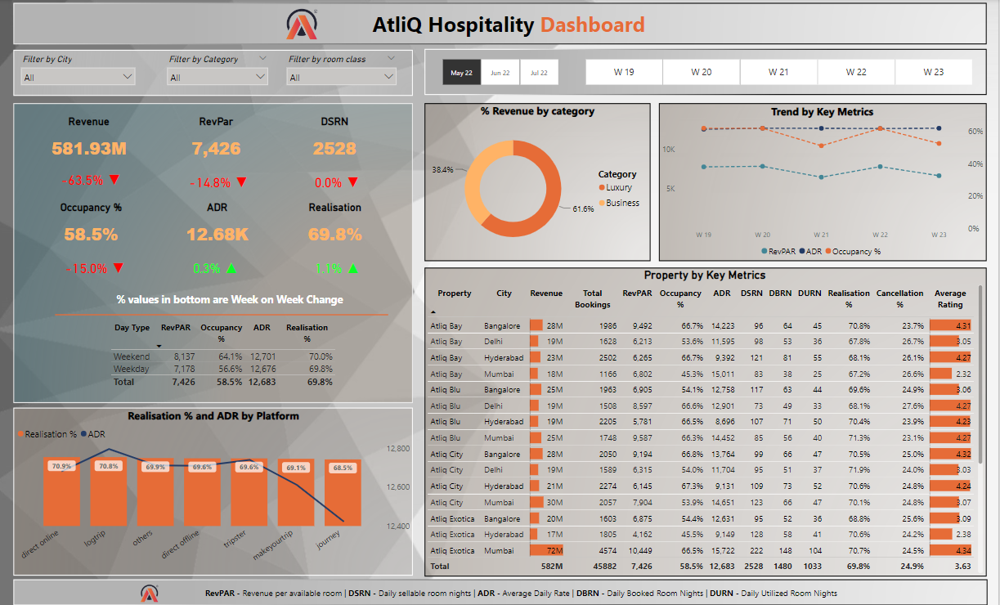
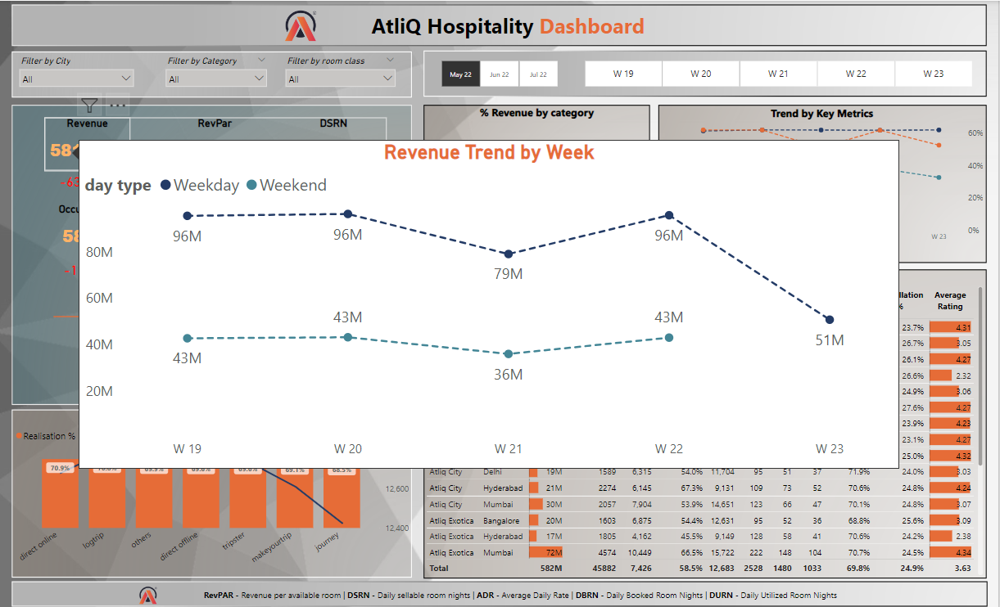
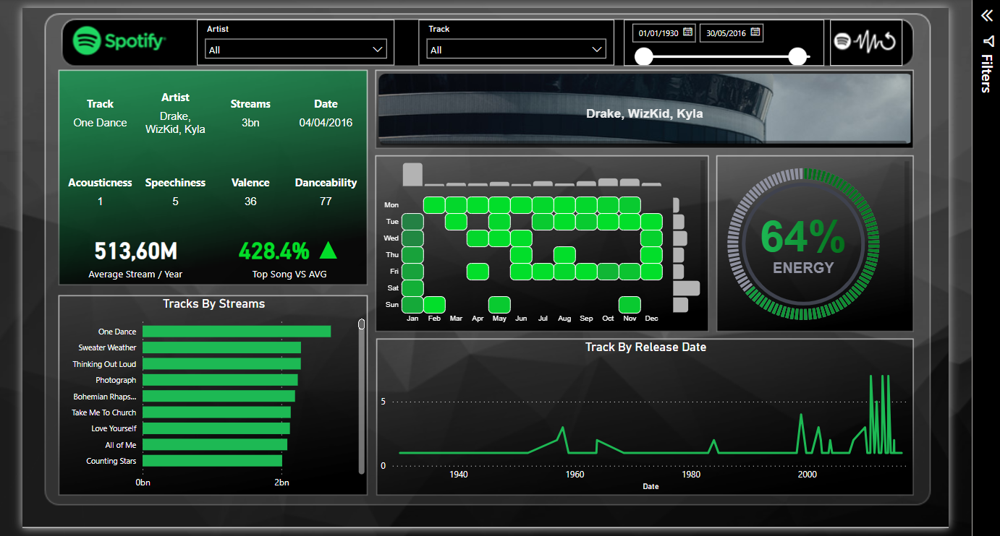
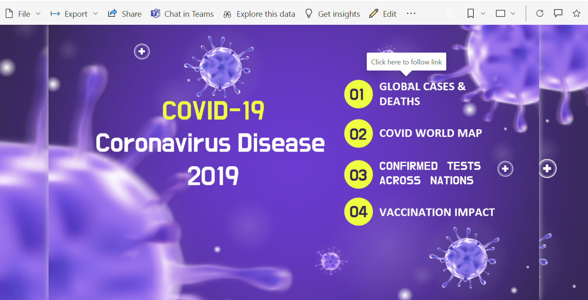
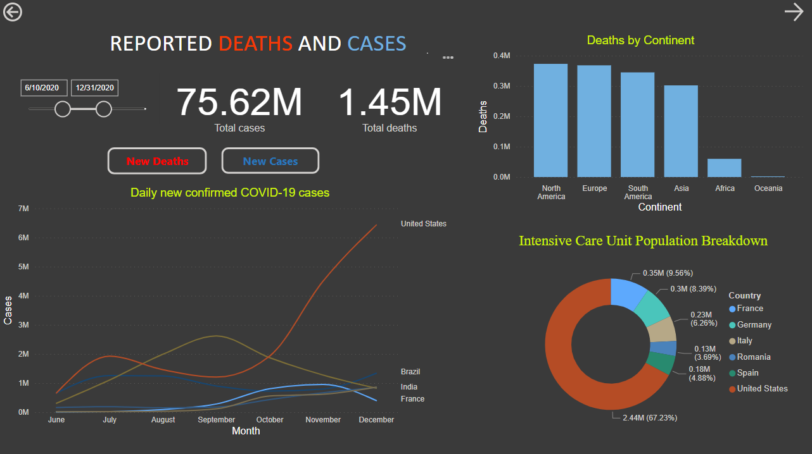
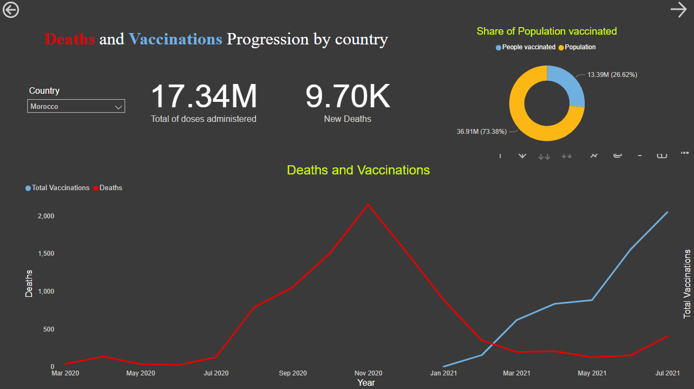

# AtliQ Hospitality Dashboard 
In this project, I learned the real time process of discussing client requirements, mocking up a dashboard, understanding hospitality domain metrics, cleaning and formatting data, performing data modeling, and creating calculated metrics using DAX.

 
 
 

### Features
The dashboard includes the following features:

* Revenue: Visualizes revenue trends over time.
* Occupancy %: Displays the percentage of occupied rooms over a selected period.
* ADR (Average Daily Rate): Presents the average rate per room per day.
* DBRN (Daily Booked Room Nights): Illustrates the number of rooms booked per day.
* DURN (Daily Utilized Room Nights): Displays the number of rooms utilized per day.
* RevPAR (Revenue per Available Room): Calculates and presents the revenue generated per available room.
* DSRN (Daily Sellable Room Nights): Shows the number of sellable room nights per day.
* Weekly Metrics Trends: Visualizes the trends of various metrics on a weekly basis.

# Spotify PowerBI Dashboard
This project analyzes the most streamed Spotify songs until 2023 using Advanced Visualization Techniques.

# COVID 19 Dashboards

